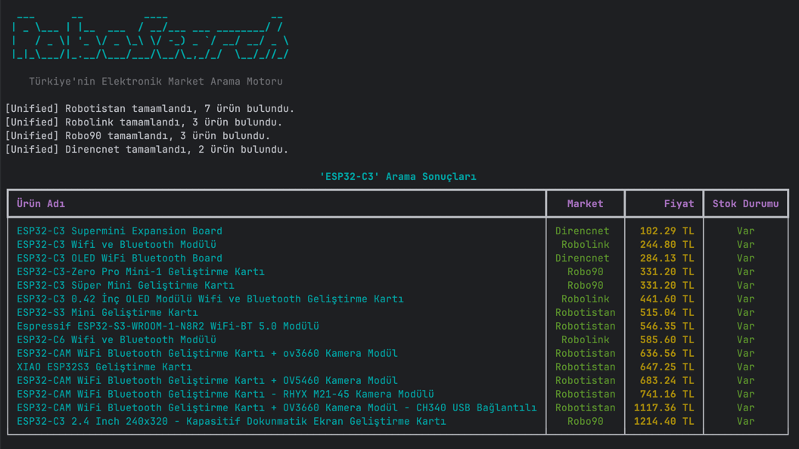
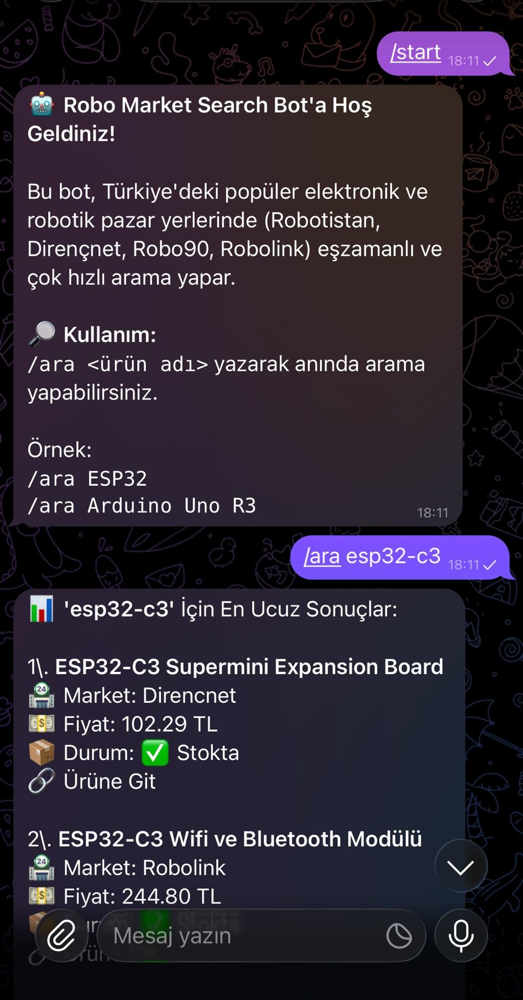
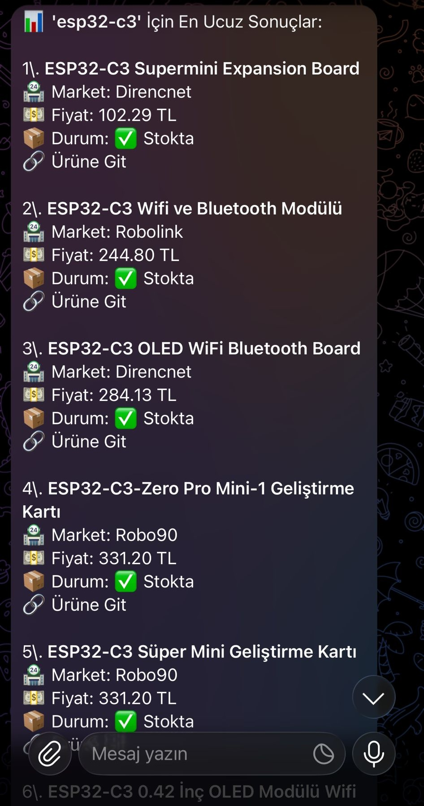
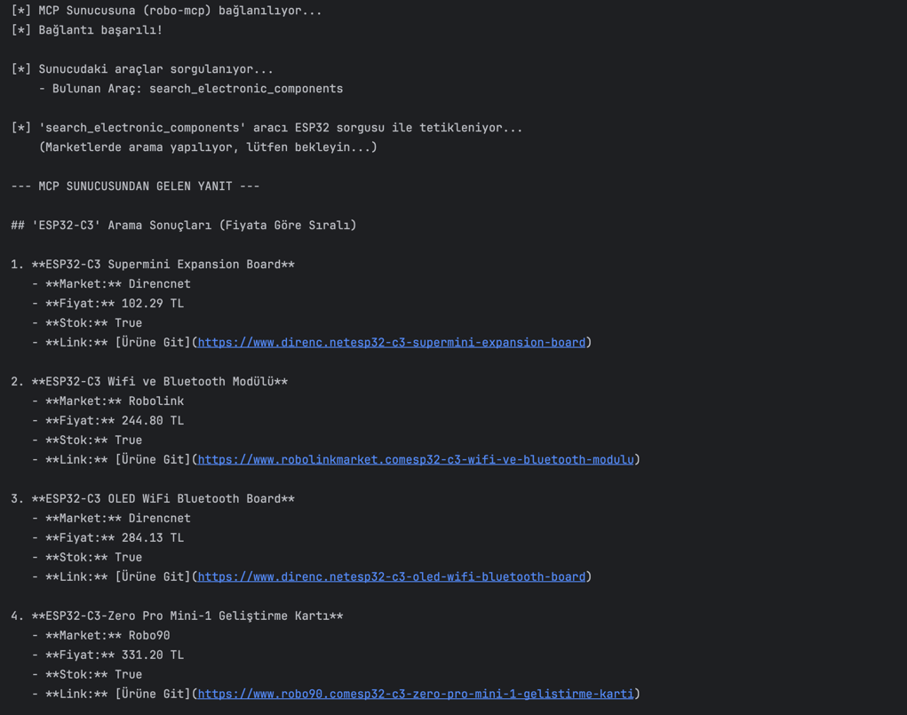

<div align="center">
  

  # Robo Market Search

  [](https://pypi.org/project/robo-market-search/)
  [](https://www.python.org/downloads/)
  [](https://opensource.org/licenses/Apache-2.0)
</div>

<br/>
Türkiye'nin en popüler 4 elektronik ve robotik pazarında (**Robolink, Robotistan, Robo90, Direnç.net**) tek satır kodla, çok hızlı ve eşzamanlı arama yapmanızı sağlayan Python istemci kütüphanesi.

Ayrıca yerleşik **CLI (Komut Satırı)** aracı ve **MCP (Model Context Protocol)** sunucusu özelliklerine sahiptir.

## Özellikler
- **Unified Search (Birleştirilmiş Arama)**: 4 markette paralel (Thread) olarak eşzamanlı arama yapar ve ürünleri ucuzdan pahalıya sıralar.
- **Standart Veri Tipi**: Tüm sonuçlar, standart `Product` objesi olarak döner.
- **Dinamik Token Mimarisi**: API key veya token değişikliklerinde otomatik güncellenerek (regex ile ana sayfalardan kazıyarak) kesintisiz çalışır.
- **Güçlü CLI**: Terminal üzerinden şık tablolar ve anlık yükleme animasyonları ile hızlı ürün araması.
- **LLM/MCP Entegrasyonu**: Claude vb. LLM asistanlarına, projeniz için donanım/elektronik malzeme arama yeteneği kazandırır.

## Kurulum

Sadece SDK (Kütüphane) özelliklerini kullanmak için:

```bash
pip install robo-market-search
```

CLI ve MCP özelliklerini de içeren **tüm ekosistemi** kurmak için:

```bash
pip install "robo-market-search[all]"
```
*(Sadece CLI için `[cli]`, sadece MCP için `[mcp]` seçeneklerini de kullanabilirsiniz.)*

## Komut Satırı Arayüzü (CLI) Kullanımı

Uygulamayı `[cli]` veya `[all]` etiketiyle kurduktan sonra terminalden anında arama yapabilirsiniz. CLI aracı `typer` ve `rich` kullanılarak geliştirilmiştir ve sonuçları terminalinizde şık, renkli bir tablo formatında sunar.



### Örnek Komutlar:

```bash
# Temel arama (Tüm marketleri tarar, en ucuzdan pahalıya sıralar)
robo-search "ESP32-WROOM"

# Limit belirterek arama (Market başına maksimum 3 ürün getirir, ekran kirliliğini önler)
robo-search "Arduino Uno" --limit 3

# Fiyat sıralamasını devreden çıkararak ham sonuçları listeleme
robo-search "PLA Filament" --no-sort
```

---

## Telegram Bot Entegrasyonu

Projenizi kişisel bir elektronik arama asistanına dönüştürmek için yerleşik bir Telegram botu da barındırır. `aiogram` kullanılarak geliştirilen bu asenkron bot, saniyeler içinde marketleri tarar ve en ucuz ürünleri size linkleriyle birlikte mesaj olarak atar.

<p align="center">
  
  &nbsp;&nbsp;&nbsp;
  
</p>

### Kullanımı

1. Telegram üzerinden `@BotFather` ile yeni bir bot oluşturun ve token'ınızı alın.
2. Botu başlatmak için terminalden komutu token ile birlikte çalıştırın:

```bash
robo-bot --token "SİZİN_TELEGRAM_TOKENINIZ"
```

*(Alternatif olarak `TELEGRAM_BOT_TOKEN` isimli bir ortam değişkeni (environment variable) tanımlayarak sadece `robo-bot` yazarak da çalıştırabilirsiniz.)*

Bot çalıştıktan sonra Telegram uygulamasından botunuza `/ara ESP32` veya `/ara Arduino Uno` yazarak doğrudan arama yapabilirsiniz.

---

## Model Context Protocol (MCP) Sunucusu

Proje, LLM'ler (örn. Claude Desktop) için resmi MCP (Model Context Protocol) sunucusu içerir. Bu sayede yapay zeka asistanınız projeleriniz için doğrudan Türkiye pazarındaki elektronik parçaların fiyat ve stok durumunu **canlı olarak** sorgulayabilir.



### Sunucuyu Başlatma ve Test Etme

MCP sunucusunun sağlıklı çalışıp çalışmadığını Claude'a bağlamadan önce test etmek isterseniz, paketle birlikte gelen örnek test script'ini çalıştırabilir veya resmi MCP Inspector aracını kullanabilirsiniz.

**1. Python İstemcisi ile Test:**
Kendi yazdığımız bir Python scripti ile sunucuyu sanki bir LLM'miş gibi tetikleyebilirsiniz:
```bash
python examples/mcp_client_example.py
```

**2. Resmi MCP Inspector ile Test (Görsel Arayüz):**
Web tarayıcınız üzerinden görsel olarak test etmek için npx ile inspector'ı başlatın:
```bash
npx @modelcontextprotocol/inspector robo-mcp
```
*(Bu komut lokalinizde bir web sunucusu başlatır ve tarayıcı üzerinden aracı test etmenize olanak tanır.)*

### LLM İstemcilerine (Clients) Kurulum

Yapay zeka asistanlarının bu aracı kullanabilmesi için ayar dosyalarına aşağıdaki JSON konfigürasyonunu eklemeniz yeterlidir:

```json
{
  "mcpServers": {
    "robo-market-search": {
      "command": "robo-mcp",
      "args": []
    }
  }
}
```

**Not:** Komutun çalışabilmesi için `robo-mcp` komutunun sistem PATH'inize eklenmiş olması gerekir. Gerekirse `"command": "/tam/yol/.venv/bin/robo-mcp"` şeklinde absolute (tam) dosya yolunu da verebilirsiniz.

Bu konfigürasyonu kullandığınız asistana göre aşağıdaki konumlara ekleyebilirsiniz:

#### 1. Claude Desktop
Windows için `%APPDATA%\Claude\claude_desktop_config.json`, macOS için `~/Library/Application Support/Claude/claude_desktop_config.json` dosyasını düzenleyip yukarıdaki JSON'ı ekleyin.

#### 2. Antigravity (Agent)
Antigravity'nin MCP ayar dosyasına (genellikle projenin kök dizinindeki veya global yapılandırma klasöründeki `mcp.json` veya `mcp_servers.json`) ilgili `mcpServers` objesini eklemeniz yeterlidir.

#### 3. Cline (VS Code) / RooCode vb. Eklentiler
VS Code üzerinde çalışan Cline veya RooCode gibi MCP destekli AI eklentileri kullanıyorsanız, ayarlardan (veya `~/.vscode/global_storage/.../cline_mcp_settings.json` üzerinden) yukarıdaki JSON'ı tanımlayarak aracı asistanınıza öğretebilirsiniz.

> [!NOTE]
> **ChatGPT, Gemini ve Ollama Desteği Hakkında:**
> ChatGPT ve Gemini'nin kendi resmi web arayüzleri veya Ollama'nın terminal arayüzü doğrudan yerel MCP sunucularını desteklemez. Ancak VS Code içerisindeki **Cline** gibi eklentilerin API ayarlarına giderek arka planda çalışacak model olarak ChatGPT, Gemini veya yerel bilgisayarınızdaki **Ollama** modellerini (örn. `llama3`) seçerseniz; bu modellerin tamamı `robo-mcp` aracımızı sorunsuzca kullanabilir.

### LLM ile Nasıl Kullanılır?
Claude ile sohbet ederken şu tarz komutlar verebilirsiniz:
* *"Bana Türkiye'den ucuz bir ESP32-CAM ve HC-SR04 bul."*
* *"Bir Arduino robot projesi yapmak istiyorum, gereken temel parçaları Türkiye marketlerinden araştırıp maliyet tablosu çıkarır mısın?"*

LLM, arka planda `robo-mcp` aracını çağırıp güncel fiyat/stok bilgilerini çekecek ve size sunacaktır.

## Hızlı Başlangıç (Python SDK / Birleştirilmiş Arama)

```python
from robo_market_search import UnifiedSearchClient

client = UnifiedSearchClient()
products = client.search(query="arduino", limit_per_store=5)

for p in products:
    print(f"[{p.store}] {p.name} - {p.price} {p.currency} (Stok: {p.in_stock})")
```

## Bireysel Market Araması

Sadece belirli bir markette arama yapmak isterseniz:

```python
from robo_market_search import RobotistanClient

client = RobotistanClient()
products = client.search_component("esp32", limit=3)
```

## Lisans
Apache License 2.0
