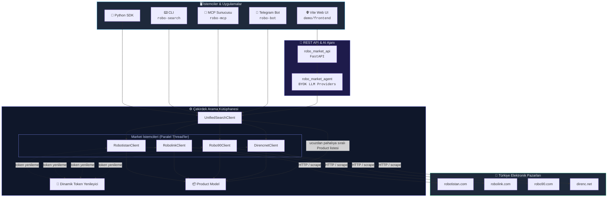
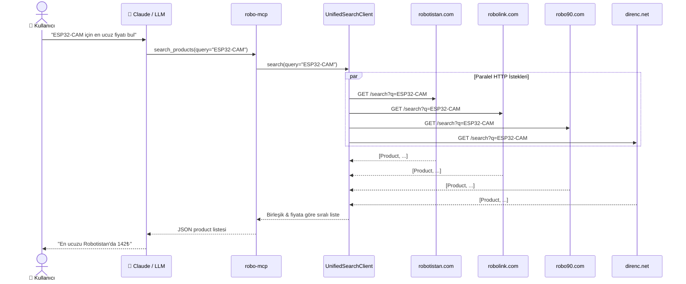

<div align="center">
  

  # Robo Market Search

  [](https://pypi.org/project/robo-market-search/)
  [](https://www.python.org/downloads/)
  [](https://opensource.org/licenses/Apache-2.0)
  [](https://github.com/AtaCanYmc/robo-market-search/actions/workflows/test.yml)
  [](https://github.com/AtaCanYmc/robo-market-search/actions/workflows/release-please.yml)
  [](CODE_OF_CONDUCT.md)
</div>

<br/>
Türkiye'nin en popüler 4 elektronik ve robotik pazarında (**Robolink, Robotistan, Robo90, Direnç.net**) tek satır kodla, çok hızlı ve eşzamanlı arama yapmanızı sağlayan Python kütüphanesi ve ekosistemi.

Ayrıca yerleşik **REST API**, **CLI (Komut Satırı)**, **MCP (Model Context Protocol)** sunucusu, **Yapay Zeka Donanım Ajanı (BYOK destekli)** ve **Vite + React Web Önyüzü** içerir.

## Özellikler
- **Unified Search (Birleştirilmiş Arama)**: 4 markette paralel (Thread) olarak eşzamanlı arama yapar ve ürünleri ucuzdan pahalıya sıralar.
- **Sepet Optimizasyonu & Kargo Hesaplama (`cart_search`)**: Birden fazla parça alırken kargo limitlerini (ücretsiz kargo eşiklerini) ve mağazalar arası bölünmüş sepet (split cart) maliyetlerini otomatik optimize eder.
- **BYOK Destekli Yapay Zeka Ajanı (AI Hardware Agent)**: Kendi API anahtarınızla (OpenAI, Gemini, Anthropic, DeepSeek, Groq, Ollama) otonom donanım analizi ve BOM listesi çıkarma.
- **Vite + React + Tailwind SPA Önyüz**: Canlı arama, filtreleme, stok takibi, sepet optimizasyonu ve **CSV/JSON/Markdown/Clipboard** formatlarında tek tıkla dışa aktarma.
- **Dinamik Token Mimarisi**: API key veya token değişikliklerinde otomatik güncellenerek kesintisiz çalışır.
- **Güçlü CLI**: Terminal üzerinden şık tablolar ve anlık yükleme animasyonları ile hızlı ürün araması.
- **LLM/MCP Entegrasyonu**: Claude Desktop, Antigravity ve VS Code Cline/RooCode asistanlarına canlı mağaza fiyat sorgulama yeteneği.

---

## 4 Katmanlı Mimari (4-Layered Architecture)

Proje tam bağımsız mantıksal katmanlardan oluşur:

```
                            ┌───────────────────────────┐
                            │      Applications / UI    │
                            │ (Vite Web UI, CLI, Bot,   │
                            │  MCP Server, Mobile Apps) │
                            └─────────────┬─────────────┘
                                          │
                                          ▼
                            ┌───────────────────────────┐
                            │      robo_market_api      │
                            │ (REST API Layer: FastAPI, │
                            │  OpenAPI, BYOK Headers)   │
                            └─────────────┬─────────────┘
                                          │
                                          ▼
                            ┌───────────────────────────┐
                            │    robo_market_agent      │
                            │ (AI Layer: Requirements,  │
                            │  BOM, BYOK Providers)     │
                            └─────────────┬─────────────┘
                                          │
                                          ▼
                            ┌───────────────────────────┐
                            │    robo_market_service    │
                            │ (Search Service: Cache,   │
                            │  Synonyms, Rank, Dedupe)  │
                            └─────────────┬─────────────┘
                                          │
                                          ▼
                            ┌───────────────────────────┐
                            │    robo_market_search     │
                            │ (Core Search Library:     │
                            │  Zero AI/HTTP Dependencies│
                            └───────────────────────────┘
```

1. **`robo_market_api`**: Üretim ortamına hazır HTTP REST API katmanı. FastAPI, Pydantic v2, Swagger UI (`/docs`), ReDoc (`/redoc`) ve Bring Your Own API Key (BYOK) desteği sunar.
2. **`robo_market_agent`**: Yapay Zeka Ajanı. Pydantic modelleri ve takılabilir LLM Sağlayıcıları (OpenAI, Gemini, Anthropic, DeepSeek, Groq, Ollama, Mock) üzerinden 7 adımlı boru hattı çalıştırır.
3. **`robo_market_service`**: Arama servis katmanı. Önbellek, eşanlamlı terim açılımı (synonyms) ve sıralama mantığı sunar.
4. **`robo_market_search`**: Temel arama kütüphanesi. Sıfır HTTP/FastAPI/AI bağımlılığına sahip saf Python SDK.

---

## Ekosistem Mimarisi


```mermaid
graph TB
    subgraph Clients["🖥️ İstemciler & Uygulamalar"]
        direction LR
        WEB["🌐 Vite Web UI<br/><code>demo/frontend</code>"]
        PY["🐍 Python SDK"]
        CLI["⌨️ CLI<br/><code>robo-search</code>"]
        MCP["🤖 MCP Sunucusu<br/><code>robo-mcp</code>"]
        BOT["💬 Telegram Bot<br/><code>robo-bot</code>"]
    end

    subgraph API["🚀 REST API & AI Ajanı"]
        REST["robo_market_api<br/><code>FastAPI</code>"]
        AGENT["robo_market_agent<br/><code>BYOK LLM Providers</code>"]
    end

    subgraph Core["⚙️ Çekirdek Arama Kütüphanesi"]
        UC["UnifiedSearchClient"]
        subgraph Scrapers["Market İstemcileri (Paralel Thread'ler)"]
            direction LR
            R1["RobotistanClient"]
            R2["RobolinkClient"]
            R3["Robo90Client"]
            R4["DirencnetClient"]
        end
        TK["🔑 Dinamik Token Yenileyici"]
        MD["📦 Product Model"]
    end

    subgraph Markets["🛒 Türkiye Elektronik Pazarları"]
        direction LR
        M1["robotistan.com"]
        M2["robolink.com"]
        M3["robo90.com"]
        M4["direnc.net"]
    end

    WEB --> REST
    PY  --> UC
    CLI --> UC
    MCP --> UC
    BOT --> UC

    REST --> AGENT
    AGENT --> UC

    UC --> R1 & R2 & R3 & R4
    R1 <-.->|token yenileme| TK
    R2 <-.->|token yenileme| TK
    R3 <-.->|token yenileme| TK
    R4 <-.->|token yenileme| TK

    R1 -->|HTTP / scrape| M1
    R2 -->|HTTP / scrape| M2
    R3 -->|HTTP / scrape| M3
    R4 -->|HTTP / scrape| M4

    R1 & R2 & R3 & R4 --> MD
    MD -->|"ucuzdan pahalıya sıralı Product listesi"| UC

    style Clients fill:#1e293b,stroke:#38bdf8,color:#e2e8f0
    style API     fill:#1e1b4b,stroke:#818cf8,color:#e2e8f0
    style Core    fill:#0f172a,stroke:#6366f1,color:#e2e8f0
    style Markets fill:#1e293b,stroke:#34d399,color:#e2e8f0
    style Scrapers fill:#0f172a,stroke:#818cf8,color:#c7d2fe
```

---

## Kurulum

`robo-market-search` ihtiyacınıza göre farklı yöntemlerle kolayca kurulabilir:

### 1. 🚀 `pipx` (CLI Araçları İçin Modern Standart - Önerilen)
Python global ortamını kirletmeden CLI, MCP ve AI Ajan araçlarını izole sanal ortama kurar:

```bash
pipx install "robo-market-search[all]"
```
> Direct GitHub installation: `pipx install "robo-market-search[all] @ git+https://github.com/AtaCanYmc/robo-market-search.git"`

---

### 2. 🍺 Homebrew Tap (macOS & Linux)
macOS veya Linux üzerinde Homebrew kullanıyorsanız tek komutla kurabilirsiniz:

```bash
brew tap atacanymc/robo-market-search
brew install robo-market-search
```

---

### 3. ⚡ Tek Tıkla Kurulum Scripti (cURL / Shell)
Otomatik bağımlılık kontrolü ve izole ortam kurulumu için terminalinizde çalıştırın:

```bash
curl -fsSL https://raw.githubusercontent.com/AtaCanYmc/robo-market-search/main/install.sh | bash
```

---

### 4. 💾 Bağımsız Executable Binary (Python Kurulumu Gerektirmez)
Bilgisayarınızda Python kurulu değilse, [GitHub Releases](https://github.com/AtaCanYmc/robo-market-search/releases) sayfasından işletim sisteminize uygun derlenmiş dosyayı (`.exe` veya executable) indirip doğrudan çalıştırabilirsiniz.

---

### 5. 📦 Python SDK & Geliştirici Kurulumu (`pip`)
Projenizde kütüphane/SDK olarak import edip kullanmak için:

```bash
# Sadece Core SDK (kazıyıcılar & birleştirilmiş arama)
pip install robo-market-search

# Tüm ekosistem (REST API + CLI + MCP + AI Agent)
pip install "robo-market-search[all]"
```

---

## Web Demo Arayüzü & Özellikleri

Projenin canlı ön izlemesini `demo/frontend` dizinindeki Vite + React + TypeScript + Tailwind CSS Single Page Application (SPA) ile deneyimleyebilirsiniz.

- **Canlı Önyüz**: [http://localhost:3000](http://localhost:3000)
- **Canlı REST API**: [https://robo-market-search.onrender.com](https://robo-market-search.onrender.com)

### Web Arayüz Özellikleri:
- **Eşzamanlı Ürün Araması**: 4 markette paralel arama, canlı stok ve renkli mağaza rozetleri.
- **Toplu Arama (Batch Search)**: Birden fazla bileşeni tek ekranda arama ve gruplama.
- **Sepet Optimizasyonu**: Mağazalar arası kargo barajlarını (ücretsiz kargo limitlerini) analiz etme.
- **BYOK Yapay Zeka Ajanı**: Kendi OpenAI, Gemini, Claude veya Ollama API anahtarınızla donanım analizi yapma.
- **Sonuçları İndirme (Export)**: Arama sonuçlarını **CSV**, **JSON**, **Markdown** formatlarında indirme veya **Panoya Kopyalama**.

---

## Komut Satırı Arayüzü (CLI) Kullanımı

Uygulamayı `[cli]` veya `[all]` etiketiyle kurduktan sonra terminalden anında arama yapabilirsiniz:

```bash
# Temel arama (Tüm marketleri tarar, en ucuzdan pahalıya sıralar)
robo-search "ESP32-WROOM"

# Limit belirterek arama
robo-search "Arduino Uno" --limit 3

# Fiyat sıralamasını devreden çıkarma
robo-search "PLA Filament" --no-sort
```

---

## REST API Sunucusu (`robo_market_api`)

Production-ready FastAPI REST API katmanı ile `robo-market-search` özelliklerini HTTP servisleri olarak sunabilirsiniz.

### 🚀 Çalıştırma

```bash
# REST API başlatma
robo-api
```
veya doğrudan Uvicorn ile:
```bash
uvicorn robo_market_api.app.main:app --host 0.0.0.0 --port 8000 --reload
```

### 📖 API Dokümantasyonu (Swagger & ReDoc)

- **Swagger UI**: [http://localhost:8000/docs](http://localhost:8000/docs)
- **ReDoc**: [http://localhost:8000/redoc](http://localhost:8000/redoc)
- **OpenAPI JSON**: [http://localhost:8000/openapi.json](http://localhost:8000/openapi.json)

### 📌 Örnek Endpoint İletişimleri

#### 🔹 Sağlık Kontrolü (`GET /health` veya `GET /api/v1/health`)
```bash
curl -X GET http://localhost:8000/api/v1/health
```
**Yanıt:**
```json
{
  "status": "ok",
  "version": "1.3.0"
}
```

#### 🔹 Ürün Arama (`POST /api/v1/search`)
```bash
curl -X POST http://localhost:8000/api/v1/search \
  -H "Content-Type: application/json" \
  -d '{"query": "ESP32", "limit": 3}'
```
**Yanıt:**
```json
{
  "success": true,
  "query": "ESP32",
  "count": 3,
  "products": [
    {
      "title": "ESP32-WROOM-32 Wi-Fi + Bluetooth Modülü",
      "price": 145.50,
      "formatted_price": "145,50 TL",
      "url": "https://www.robotistan.com/esp32",
      "store": "robotistan",
      "in_stock": true
    }
  ]
}
```

#### 🔹 Toplu Arama (`POST /api/v1/search/batch`)
```bash
curl -X POST http://localhost:8000/api/v1/search/batch \
  -H "Content-Type: application/json" \
  -d '{"queries": ["ESP32", "Relay 5V", "OLED 0.96"]}'
```

#### 🔹 Mağaza Sağlayıcıları (`GET /api/v1/providers`)
```bash
curl -X GET http://localhost:8000/api/v1/providers
```

#### 🔹 Belirli Bir Mağazada Arama (`POST /api/v1/providers/{provider}`)
```bash
curl -X POST http://localhost:8000/api/v1/providers/robotistan \
  -H "Content-Type: application/json" \
  -d '{"query": "Arduino Uno"}'
```

---


## Web Demo Arayüzü

Projenin canlı ön izlemesini ve kullanıcı dostu web arayüzünü `demo/` dizinindeki FastAPI + HTMX uygulaması ile deneyimleyebilirsiniz.


### Web Arayüz Özellikleri:
- **Canlı & Paralel Arama:** HTMX ile sayfa yenilenmeden hızlı sonuç gösterimi.
- **Filtreleme & Sıralama:** Mağaza filtreleme çipler, stok filtreleme, fiyat aralığı süzgeci ve ucuzdan pahalıya sıralama.
- **Sonuçları İndirme (Export):** Arama sonuçlarını **CSV** veya **JSON** formatında tek tıkla indirme.
- **Responsive & Dark Mode:** Şık, modern ve mobil uyumlu cam tasarımlı (glassmorphic) arayüz.

---

## Telegram Bot Entegrasyonu

Projenizi kişisel bir elektronik arama asistanına dönüştürmek için yerleşik bir Telegram botu da barındırır. `aiogram` kullanılarak geliştirilen bu asenkron bot, saniyeler içinde marketleri tarar ve en ucuz ürünleri size linkleriyle birlikte mesaj olarak atar.

<p align="center">
  
  &nbsp;&nbsp;&nbsp;
  
</p>

### Kullanımı

1. Telegram üzerinden `@BotFather` ile yeni bir bot oluşturun ve token'ınızı alın.
2. Botu başlatmak için terminalden komutu token ile birlikte çalıştırın:

```bash
robo-bot --token "SİZİN_TELEGRAM_TOKENINIZ"
```

*(Alternatif olarak `TELEGRAM_BOT_TOKEN` isimli bir ortam değişkeni (environment variable) tanımlayarak sadece `robo-bot` yazarak da çalıştırabilirsiniz.)*

Bot çalıştıktan sonra Telegram uygulamasından botunuza `/ara ESP32` veya `/ara Arduino Uno` yazarak doğrudan arama yapabilirsiniz.

---

## Model Context Protocol (MCP) Sunucusu

Proje, LLM'ler (örn. Claude Desktop) için resmi MCP (Model Context Protocol) sunucusu içerir. Bu sayede yapay zeka asistanınız projeleriniz için doğrudan Türkiye pazarındaki elektronik parçaların fiyat ve stok durumunu **canlı olarak** sorgulayabilir.


### Sunucuyu Başlatma ve Test Etme

MCP sunucusunun sağlıklı çalışıp çalışmadığını Claude'a bağlamadan önce test etmek isterseniz, paketle birlikte gelen örnek test script'ini çalıştırabilir veya resmi MCP Inspector aracını kullanabilirsiniz.

**1. Python İstemcisi ile Test:**
Kendi yazdığımız bir Python scripti ile sunucuyu sanki bir LLM'miş gibi tetikleyebilirsiniz:
```bash
python examples/mcp_client_example.py
```

**2. Resmi MCP Inspector ile Test (Görsel Arayüz):**
Web tarayıcınız üzerinden görsel olarak test etmek için npx ile inspector'ı başlatın:
```bash
npx @modelcontextprotocol/inspector robo-mcp
```
*(Bu komut lokalinizde bir web sunucusu başlatır ve tarayıcı üzerinden aracı test etmenize olanak tanır.)*

### LLM İstemcilerine (Clients) Kurulum

Yapay zeka asistanlarının bu aracı kullanabilmesi için ayar dosyalarına aşağıdaki JSON konfigürasyonunu eklemeniz yeterlidir:

```json
{
  "mcpServers": {
    "robo-market-search": {
      "command": "robo-mcp",
      "args": []
    }
  }
}
```

**Not:** Komutun çalışabilmesi için `robo-mcp` komutunun sistem PATH'inize eklenmiş olması gerekir. Gerekirse `"command": "/tam/yol/.venv/bin/robo-mcp"` şeklinde absolute (tam) dosya yolunu da verebilirsiniz.

Bu konfigürasyonu kullandığınız asistana göre aşağıdaki konumlara ekleyebilirsiniz:

#### 1. Claude Desktop
Windows için `%APPDATA%\Claude\claude_desktop_config.json`, macOS için `~/Library/Application Support/Claude/claude_desktop_config.json` dosyasını düzenleyip yukarıdaki JSON'ı ekleyin.

#### 2. Antigravity (Agent)
Antigravity'nin MCP ayar dosyasına (genellikle projenin kök dizinindeki veya global yapılandırma klasöründeki `mcp.json` veya `mcp_servers.json`) ilgili `mcpServers` objesini eklemeniz yeterlidir.

#### 3. Cline (VS Code) / RooCode vb. Eklentiler
VS Code üzerinde çalışan Cline veya RooCode gibi MCP destekli AI eklentileri kullanıyorsanız, ayarlardan (veya `~/.vscode/global_storage/.../cline_mcp_settings.json` üzerinden) yukarıdaki JSON'ı tanımlayarak aracı asistanınıza öğretebilirsiniz.

> [!NOTE]
> **ChatGPT, Gemini ve Ollama Desteği Hakkında:**
> ChatGPT ve Gemini'nin kendi resmi web arayüzleri veya Ollama'nın terminal arayüzü doğrudan yerel MCP sunucularını desteklemez. Ancak VS Code içerisindeki **Cline** gibi eklentilerin API ayarlarına giderek arka planda çalışacak model olarak ChatGPT, Gemini veya yerel bilgisayarınızdaki **Ollama** modellerini (örn. `llama3`) seçerseniz; bu modellerin tamamı `robo-mcp` aracımızı sorunsuzca kullanabilir.

### LLM ile Nasıl Kullanılır?
Claude ile sohbet ederken şu tarz komutlar verebilirsiniz:
* *"Bana Türkiye'den ucuz bir ESP32-CAM ve HC-SR04 bul."*
* *"Bir Arduino robot projesi yapmak istiyorum, gereken temel parçaları Türkiye marketlerinden araştırıp maliyet tablosu çıkarır mısın?"*

LLM, arka planda `robo-mcp` aracını çağırıp güncel fiyat/stok bilgilerini çekecek ve size sunacaktır.

### MCP Arama Akışı


```mermaid
sequenceDiagram
    actor User as 👤 Kullanıcı
    participant LLM as 🤖 Claude / LLM
    participant MCP as robo-mcp
    participant UC  as UnifiedSearchClient
    participant M1  as robotistan.com
    participant M2  as robolink.com
    participant M3  as robo90.com
    participant M4  as direnc.net

    User->>LLM: "ESP32-CAM için en ucuz fiyatı bul"
    LLM->>MCP: search_products(query="ESP32-CAM")
    MCP->>UC: search(query="ESP32-CAM")

    par Paralel HTTP İstekleri
        UC->>M1: GET /search?q=ESP32-CAM
        UC->>M2: GET /search?q=ESP32-CAM
        UC->>M3: GET /search?q=ESP32-CAM
        UC->>M4: GET /search?q=ESP32-CAM
    end

    M1-->>UC: [Product, ...]
    M2-->>UC: [Product, ...]
    M3-->>UC: [Product, ...]
    M4-->>UC: [Product, ...]

    UC-->>MCP: Birleşik & fiyata göre sıralı liste
    MCP-->>LLM: JSON product listesi
    LLM-->>User: "En ucuzu Robotistan'da 142₺"
```

## Hızlı Başlangıç (Python SDK / Birleştirilmiş Arama)

```python
from robo_market_search import UnifiedSearchClient

client = UnifiedSearchClient()
products = client.search(query="arduino", limit_per_store=5)

for p in products:
    print(f"[{p.store}] {p.name} - {p.price} {p.currency} (Stok: {p.in_stock})")
```

## Bireysel Market Araması

Sadece belirli bir markette arama yapmak isterseniz:

```python
from robo_market_search import RobotistanClient

client = RobotistanClient()
products = client.search_component("esp32", limit=3)
```

## Sepet Optimizasyonu ve Kargo Hesaplama (`cart_search`)

> 👨🏻‍💻 [**Sha-Dox**](https://github.com/Sha-Dox) tarafından projeye kazandırılmıştır.*

Birden fazla malzeme satın almak istediğinizde, parçaları tek bir mağazadan mı yoksa kargo limitlerini (ücretsiz kargo eşiklerini) dikkate alarak farklı mağazalar arasında bölüşerek mi almanızın daha ucuza geleceğini otomatik hesaplayabilirsiniz:

```python
from robo_market_search import UnifiedSearchClient

client = UnifiedSearchClient()

# Birden fazla ürün için en optimal sepet kombinasyonunu bul
result = client.cart_search(queries=["ESP32", "L298N", "HC-SR04"])

# 1. Tüm mağazaların sepete özel toplamı ve kargo ücretleri
for summary in result.store_summaries:
    print(
        f"[{summary.store}] Ürün: {summary.total_price} TL | Kargo: {summary.shipping_cost} TL | Toplam: {summary.total_with_shipping} TL"
    )

# 2. Mağazalar arası en ucuz bölünmüş sepet kombinasyonu (Optimal Split)
if result.best_split:
    print(f"🏆 En Optimal Genel Toplam: {result.best_split.grand_total} TL")
```

*(Detaylı çalışan örnek için [`examples/cart_search_example.py`](examples/cart_search_example.py) dosyasına göz atabilirsiniz.)*

## Sıkça Sorulan Sorular (S.S.S. / FAQ)

<details>
<summary><b>❓ Hangi sitenin SEO'su daha iyi ise ona arama sonuçlarında öncelik veriliyor mu?</b></summary>
<br/>

**Hayır, kesinlikle hayır.**

Robo Market Search bir Google veya Yandex gibi web arama motoru değildir; sitelerin SEO puanları, Backlink'leri veya Google sıralamaları sonuçlarımızı **hiçbir şekilde etkilemez.**

Sistem tamamen tarafsız bir kazıma (scraping) ve fiyat karşılaştırma mantığıyla çalışır:
1. Bir kelime aratıldığında 4 marketin (Robotistan, Robolink, Robo90, Direnç.net) kendi iç arama motorlarına **eşzamanlı (paralel)** doğrudan istek atılır.
2. Gelen tüm ürünler eşit şartlarda toplanır ve standart `Product` modeline dönüştürülür.
3. Varsayılan olarak sonuçlar **sadece ve sadece ürün fiyatına göre (en ucuzdan en pahalıya)** sıralanır.

Dolayısıyla hiçbir markete SEO veya popülerlik avantajı tanınmaz; kullanıcıya her zaman en net ve en ucuz fiyat alternatifi sunulur.
</details>

<details>
<summary><b>❓ Ürünlerin fiyat ve stok bilgileri ne kadar güncel?</b></summary>
<br/>

Arama yapıldığı an 4 marketin canlı arama API ve web sayfalarına anlık HTTP istekleri atılır. Dolayısıyla görüntülenen fiyat ve stok durumu **%100 canlı ve anlıktır.** Ayrıca önbellek (cache) mekanizması isteğe bağlı çalışır ve varsayılan olarak 2 saatte bir güncellenir.
</details>

<details>
<summary><b>❓ Birden fazla farklı parça alırken kargo ücretlerini nasıl optimize ediyorsunuz?</b></summary>
<br/>

`cart_search` metodu veya web demomuzdaki sepet optimizasyonu özelliği sayesindedir. Sistem, listenizdeki parçaların hangi marketlerde olduğunu ve her marketin **ücretsiz kargo barajını (örn. 250 TL üzeri bedava kargo)** analiz eder. Ürünleri tek bir mağazadan toplu almak mı yoksa kargo limitlerini aşacak şekilde mağazalar arasında bölüşmek mi (split cart) daha ucuza gelir otomatik hesaplar.
</details>

<details>
<summary><b>❓ Yeni bir elektronik mağazası eklemek istersem ne yapmalıyım?</b></summary>
<br/>

Projemiz modüler bir mimariye sahiptir! Yeni bir market eklemek için `robo_market_search/` altında yeni bir klasör açıp `search_component` metoduna sahip bir `BaseClient` türevi oluşturmanız yeterlidir. Katkıda bulunmak için [CONTRIBUTING.md](CONTRIBUTING.md) belgesini inceleyebilir veya Pull Request açabilirsiniz.
</details>

<details>
<summary><b>❓ Claude, ChatGPT veya VS Code üzerinde MCP (Model Context Protocol) olarak nasıl kullanabilirim?</b></summary>
<br/>

`pip install "robo-market-search[all]"` kurulumundan sonra gelen `robo-mcp` komutunu Claude Desktop veya VS Code (Cline / RooCode) ayarlarınızdaki `mcpServers` bölümüne eklemeniz yeterlidir. Detaylı rehber yukarıdaki **Model Context Protocol (MCP) Sunucusu** başlığında adım adım açıklanmıştır.
</details>

## Katkıda Bulunma

Katkılarınızı memnuniyetle karşılıyoruz! Lütfen [CONTRIBUTING.md](CONTRIBUTING.md) dosyasını okuyun.

## Katkıda Bulunanlar (Contributors) & Teşekkürler

Projemizin gelişmesinde emeği geçen ve katkıda bulunan tüm topluluk üyelerine teşekkür ederiz!

- [**Sha-Dox**](https://github.com/Sha-Dox) — Sepet optimizasyonu, kargo ücreti hesaplaması ve multi-store split algoritmalarının (`cart_search`) geliştirilmesine katkılarından dolayı özel teşekkürler!

## Güvenlik

Güvenlik açığı bildirimi için [SECURITY.md](SECURITY.md) dosyasındaki talimatları izleyin.

## Davranış Kuralları

Bu proje [Katılımcı Sözleşmesi](CODE_OF_CONDUCT.md) ile yönetilmektedir.

## Lisans
Apache License 2.0
