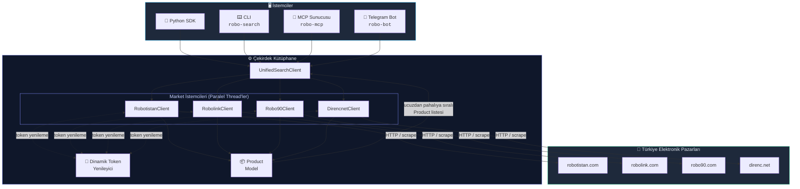
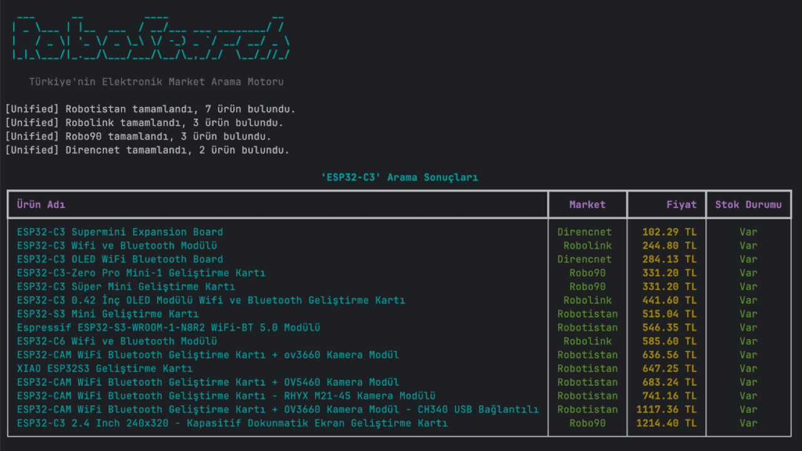
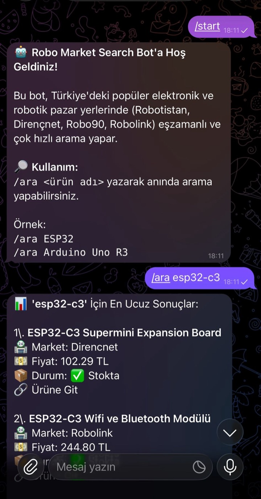
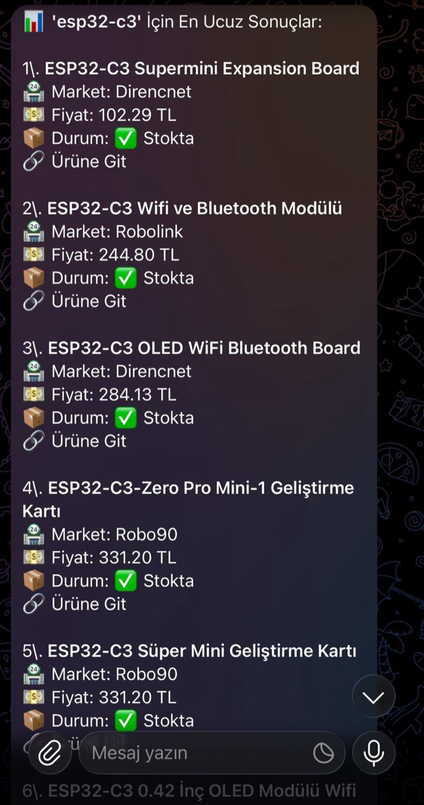
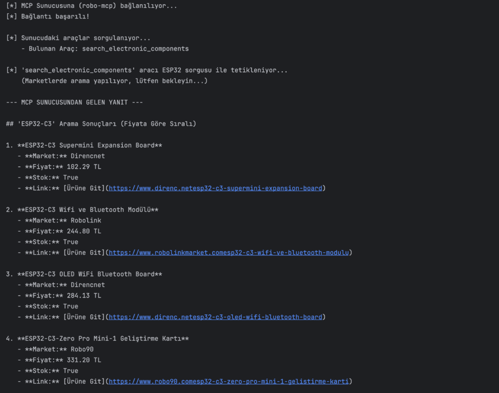
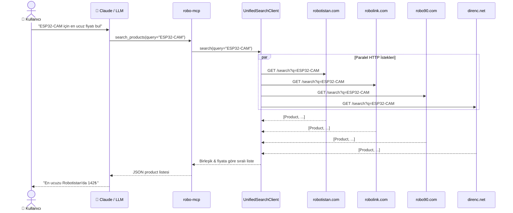

<div align="center">
  

  # Robo Market Search

  [](https://pypi.org/project/robo-market-search/)
  [](https://www.python.org/downloads/)
  [](https://opensource.org/licenses/Apache-2.0)
  [](https://github.com/AtaCanYmc/robo-market-search/actions/workflows/test.yml)
  [](https://github.com/AtaCanYmc/robo-market-search/actions/workflows/release-please.yml)
  [](CODE_OF_CONDUCT.md)
</div>

<br/>
Türkiye'nin en popüler 4 elektronik ve robotik pazarında (**Robolink, Robotistan, Robo90, Direnç.net**) tek satır kodla, çok hızlı ve eşzamanlı arama yapmanızı sağlayan Python istemci kütüphanesi.

Ayrıca yerleşik **CLI (Komut Satırı)** aracı ve **MCP (Model Context Protocol)** sunucusu özelliklerine sahiptir.

## Özellikler
- **Unified Search (Birleştirilmiş Arama)**: 4 markette paralel (Thread) olarak eşzamanlı arama yapar ve ürünleri ucuzdan pahalıya sıralar.
- **Sepet Optimizasyonu & Kargo Hesaplama (`cart_search`)**: Birden fazla parça alırken kargo limitlerini (ücretsiz kargo eşiklerini) ve mağazalar arası bölünmüş sepet (split cart) maliyetlerini otomatik optimize eder.
- **Standart Veri Tipi**: Tüm sonuçlar, standart `Product` objesi olarak döner.
- **Dinamik Token Mimarisi**: API key veya token değişikliklerinde otomatik güncellenerek (regex ile ana sayfalardan kazıyarak) kesintisiz çalışır.
- **Güçlü CLI**: Terminal üzerinden şık tablolar ve anlık yükleme animasyonları ile hızlı ürün araması.
- **LLM/MCP Entegrasyonu**: Claude vb. LLM asistanlarına, projeniz için donanım/elektronik malzeme arama yeteneği kazandırır.

## 3 Katmanlı Mimari (3-Layered Architecture)

Proje 3 tam bağımsız mantıksal katmandan oluşur:

```
                            ┌───────────────────────────┐
                            │    robo_market_agent      │
                            │ (AI Layer: Requirements,  │
                            │  BOM, Compatibility, Cart)│
                            └─────────────┬─────────────┘
                                          │
                                          ▼
                            ┌───────────────────────────┐
                            │    robo_market_service    │
                            │ (Search Service: Cache,   │
                            │  Synonyms, Rank, Dedupe)  │
                            └─────────────┬─────────────┘
                                          │
                                          ▼
                            ┌───────────────────────────┐
                            │    robo_market_search     │
                            │ (Core Search Library:     │
                            │  Zero AI Dependencies)    │
                            └───────────────────────────┘
```

1. **`robo_market_search`**: Temel arama kütüphanesi. Sıfır yapay zeka bağımlılığına sahiptir. Doğrudan mağaza kazıyıcıları ve `search()`, `search_multiple()`, `search_provider()` gibi temel fonksiyonları sunar.
2. **`robo_market_service`**: Arama servis katmanı. Paralel arama, yeniden deneme (retries), SQLite önbellek, elektronik terim eşanlamlı açılımı (synonym expansion), ürün tekilleştirme (deduplication) ve skorlama sıralaması sunar.
3. **`robo_market_agent`**: Yapay Zeka Ajanı. Pydantic modelleri ve takılabilir LLM Sağlayıcıları (OpenAI, Anthropic, Gemini, Ollama, Mock) üzerinden 8 adımlı boru hattı (pipeline) çalıştırır:
   - Project Understanding -> Requirement Extraction -> BOM Generation -> Compatibility Check -> Component Search -> Product Normalization -> Cart Optimization -> Final Markdown Report


## Ekosistem Mimarisi


```mermaid
graph TB
    subgraph Clients["🖥️  İstemciler"]
        direction LR
        PY["🐍 Python SDK"]
        CLI["⌨️  CLI<br/><code>robo-search</code>"]
        MCP["🤖 MCP Sunucusu<br/><code>robo-mcp</code>"]
        BOT["💬 Telegram Bot<br/><code>robo-bot</code>"]
    end

    subgraph Core["⚙️  Çekirdek Kütüphane"]
        UC["UnifiedSearchClient"]
        subgraph Scrapers["Market İstemcileri (Paralel Thread'ler)"]
            direction LR
            R1["RobotistanClient"]
            R2["RobolinkClient"]
            R3["Robo90Client"]
            R4["DirencnetClient"]
        end
        TK["🔑 Dinamik Token
Yenileyici"]
        MD["📦 Product
Model"]
    end

    subgraph Markets["🛒 Türkiye Elektronik Pazarları"]
        direction LR
        M1["robotistan.com"]
        M2["robolink.com"]
        M3["robo90.com"]
        M4["direnc.net"]
    end

    PY  --> UC
    CLI --> UC
    MCP --> UC
    BOT --> UC

    UC --> R1 & R2 & R3 & R4
    R1 <-.->|token yenileme| TK
    R2 <-.->|token yenileme| TK
    R3 <-.->|token yenileme| TK
    R4 <-.->|token yenileme| TK

    R1 -->|HTTP / scrape| M1
    R2 -->|HTTP / scrape| M2
    R3 -->|HTTP / scrape| M3
    R4 -->|HTTP / scrape| M4

    R1 & R2 & R3 & R4 --> MD
    MD -->|"ucuzdan pahalıya sıralı\nProduct listesi"| UC

    style Clients  fill:#1e293b,stroke:#38bdf8,color:#e2e8f0
    style Core     fill:#0f172a,stroke:#818cf8,color:#e2e8f0
    style Markets  fill:#1e293b,stroke:#34d399,color:#e2e8f0
    style Scrapers fill:#0f172a,stroke:#818cf8,color:#c7d2fe
```

## Kurulum

Sadece SDK (Kütüphane) özelliklerini kullanmak için:

```bash
pip install robo-market-search
```

CLI ve MCP özelliklerini de içeren **tüm ekosistemi** kurmak için:

```bash
pip install "robo-market-search[all]"
```
*(Sadece CLI için `[cli]`, sadece MCP için `[mcp]` seçeneklerini de kullanabilirsiniz.)*

## Komut Satırı Arayüzü (CLI) Kullanımı

Uygulamayı `[cli]` veya `[all]` etiketiyle kurduktan sonra terminalden anında arama yapabilirsiniz. CLI aracı `typer` ve `rich` kullanılarak geliştirilmiştir ve sonuçları terminalinizde şık, renkli bir tablo formatında sunar.



### Örnek Komutlar:

```bash
# Temel arama (Tüm marketleri tarar, en ucuzdan pahalıya sıralar)
robo-search "ESP32-WROOM"

# Limit belirterek arama (Market başına maksimum 3 ürün getirir, ekran kirliliğini önler)
robo-search "Arduino Uno" --limit 3

# Fiyat sıralamasını devreden çıkararak ham sonuçları listeleme
robo-search "PLA Filament" --no-sort
```

---

## Web Demo Arayüzü

Projenin canlı ön izlemesini ve kullanıcı dostu web arayüzünü `demo/` dizinindeki FastAPI + HTMX uygulaması ile deneyimleyebilirsiniz.


### Web Arayüz Özellikleri:
- **Canlı & Paralel Arama:** HTMX ile sayfa yenilenmeden hızlı sonuç gösterimi.
- **Filtreleme & Sıralama:** Mağaza filtreleme çipler, stok filtreleme, fiyat aralığı süzgeci ve ucuzdan pahalıya sıralama.
- **Sonuçları İndirme (Export):** Arama sonuçlarını **CSV** veya **JSON** formatında tek tıkla indirme.
- **Responsive & Dark Mode:** Şık, modern ve mobil uyumlu cam tasarımlı (glassmorphic) arayüz.

---

## Telegram Bot Entegrasyonu

Projenizi kişisel bir elektronik arama asistanına dönüştürmek için yerleşik bir Telegram botu da barındırır. `aiogram` kullanılarak geliştirilen bu asenkron bot, saniyeler içinde marketleri tarar ve en ucuz ürünleri size linkleriyle birlikte mesaj olarak atar.

<p align="center">
  
  &nbsp;&nbsp;&nbsp;
  
</p>

### Kullanımı

1. Telegram üzerinden `@BotFather` ile yeni bir bot oluşturun ve token'ınızı alın.
2. Botu başlatmak için terminalden komutu token ile birlikte çalıştırın:

```bash
robo-bot --token "SİZİN_TELEGRAM_TOKENINIZ"
```

*(Alternatif olarak `TELEGRAM_BOT_TOKEN` isimli bir ortam değişkeni (environment variable) tanımlayarak sadece `robo-bot` yazarak da çalıştırabilirsiniz.)*

Bot çalıştıktan sonra Telegram uygulamasından botunuza `/ara ESP32` veya `/ara Arduino Uno` yazarak doğrudan arama yapabilirsiniz.

---

## Model Context Protocol (MCP) Sunucusu

Proje, LLM'ler (örn. Claude Desktop) için resmi MCP (Model Context Protocol) sunucusu içerir. Bu sayede yapay zeka asistanınız projeleriniz için doğrudan Türkiye pazarındaki elektronik parçaların fiyat ve stok durumunu **canlı olarak** sorgulayabilir.



### Sunucuyu Başlatma ve Test Etme

MCP sunucusunun sağlıklı çalışıp çalışmadığını Claude'a bağlamadan önce test etmek isterseniz, paketle birlikte gelen örnek test script'ini çalıştırabilir veya resmi MCP Inspector aracını kullanabilirsiniz.

**1. Python İstemcisi ile Test:**
Kendi yazdığımız bir Python scripti ile sunucuyu sanki bir LLM'miş gibi tetikleyebilirsiniz:
```bash
python examples/mcp_client_example.py
```

**2. Resmi MCP Inspector ile Test (Görsel Arayüz):**
Web tarayıcınız üzerinden görsel olarak test etmek için npx ile inspector'ı başlatın:
```bash
npx @modelcontextprotocol/inspector robo-mcp
```
*(Bu komut lokalinizde bir web sunucusu başlatır ve tarayıcı üzerinden aracı test etmenize olanak tanır.)*

### LLM İstemcilerine (Clients) Kurulum

Yapay zeka asistanlarının bu aracı kullanabilmesi için ayar dosyalarına aşağıdaki JSON konfigürasyonunu eklemeniz yeterlidir:

```json
{
  "mcpServers": {
    "robo-market-search": {
      "command": "robo-mcp",
      "args": []
    }
  }
}
```

**Not:** Komutun çalışabilmesi için `robo-mcp` komutunun sistem PATH'inize eklenmiş olması gerekir. Gerekirse `"command": "/tam/yol/.venv/bin/robo-mcp"` şeklinde absolute (tam) dosya yolunu da verebilirsiniz.

Bu konfigürasyonu kullandığınız asistana göre aşağıdaki konumlara ekleyebilirsiniz:

#### 1. Claude Desktop
Windows için `%APPDATA%\Claude\claude_desktop_config.json`, macOS için `~/Library/Application Support/Claude/claude_desktop_config.json` dosyasını düzenleyip yukarıdaki JSON'ı ekleyin.

#### 2. Antigravity (Agent)
Antigravity'nin MCP ayar dosyasına (genellikle projenin kök dizinindeki veya global yapılandırma klasöründeki `mcp.json` veya `mcp_servers.json`) ilgili `mcpServers` objesini eklemeniz yeterlidir.

#### 3. Cline (VS Code) / RooCode vb. Eklentiler
VS Code üzerinde çalışan Cline veya RooCode gibi MCP destekli AI eklentileri kullanıyorsanız, ayarlardan (veya `~/.vscode/global_storage/.../cline_mcp_settings.json` üzerinden) yukarıdaki JSON'ı tanımlayarak aracı asistanınıza öğretebilirsiniz.

> [!NOTE]
> **ChatGPT, Gemini ve Ollama Desteği Hakkında:**
> ChatGPT ve Gemini'nin kendi resmi web arayüzleri veya Ollama'nın terminal arayüzü doğrudan yerel MCP sunucularını desteklemez. Ancak VS Code içerisindeki **Cline** gibi eklentilerin API ayarlarına giderek arka planda çalışacak model olarak ChatGPT, Gemini veya yerel bilgisayarınızdaki **Ollama** modellerini (örn. `llama3`) seçerseniz; bu modellerin tamamı `robo-mcp` aracımızı sorunsuzca kullanabilir.

### LLM ile Nasıl Kullanılır?
Claude ile sohbet ederken şu tarz komutlar verebilirsiniz:
* *"Bana Türkiye'den ucuz bir ESP32-CAM ve HC-SR04 bul."*
* *"Bir Arduino robot projesi yapmak istiyorum, gereken temel parçaları Türkiye marketlerinden araştırıp maliyet tablosu çıkarır mısın?"*

LLM, arka planda `robo-mcp` aracını çağırıp güncel fiyat/stok bilgilerini çekecek ve size sunacaktır.

### MCP Arama Akışı


```mermaid
sequenceDiagram
    actor User as 👤 Kullanıcı
    participant LLM as 🤖 Claude / LLM
    participant MCP as robo-mcp
    participant UC  as UnifiedSearchClient
    participant M1  as robotistan.com
    participant M2  as robolink.com
    participant M3  as robo90.com
    participant M4  as direnc.net

    User->>LLM: "ESP32-CAM için en ucuz fiyatı bul"
    LLM->>MCP: search_products(query="ESP32-CAM")
    MCP->>UC: search(query="ESP32-CAM")

    par Paralel HTTP İstekleri
        UC->>M1: GET /search?q=ESP32-CAM
        UC->>M2: GET /search?q=ESP32-CAM
        UC->>M3: GET /search?q=ESP32-CAM
        UC->>M4: GET /search?q=ESP32-CAM
    end

    M1-->>UC: [Product, ...]
    M2-->>UC: [Product, ...]
    M3-->>UC: [Product, ...]
    M4-->>UC: [Product, ...]

    UC-->>MCP: Birleşik & fiyata göre sıralı liste
    MCP-->>LLM: JSON product listesi
    LLM-->>User: "En ucuzu Robotistan'da 142₺"
```

## Hızlı Başlangıç (Python SDK / Birleştirilmiş Arama)

```python
from robo_market_search import UnifiedSearchClient

client = UnifiedSearchClient()
products = client.search(query="arduino", limit_per_store=5)

for p in products:
    print(f"[{p.store}] {p.name} - {p.price} {p.currency} (Stok: {p.in_stock})")
```

## Bireysel Market Araması

Sadece belirli bir markette arama yapmak isterseniz:

```python
from robo_market_search import RobotistanClient

client = RobotistanClient()
products = client.search_component("esp32", limit=3)
```

## Sepet Optimizasyonu ve Kargo Hesaplama (`cart_search`)

> 👨🏻‍💻 [**Sha-Dox**](https://github.com/Sha-Dox) tarafından projeye kazandırılmıştır.*

Birden fazla malzeme satın almak istediğinizde, parçaları tek bir mağazadan mı yoksa kargo limitlerini (ücretsiz kargo eşiklerini) dikkate alarak farklı mağazalar arasında bölüşerek mi almanızın daha ucuza geleceğini otomatik hesaplayabilirsiniz:

```python
from robo_market_search import UnifiedSearchClient

client = UnifiedSearchClient()

# Birden fazla ürün için en optimal sepet kombinasyonunu bul
result = client.cart_search(queries=["ESP32", "L298N", "HC-SR04"])

# 1. Tüm mağazaların sepete özel toplamı ve kargo ücretleri
for summary in result.store_summaries:
    print(f"[{summary.store}] Ürün: {summary.total_price} TL | Kargo: {summary.shipping_cost} TL | Toplam: {summary.total_with_shipping} TL")

# 2. Mağazalar arası en ucuz bölünmüş sepet kombinasyonu (Optimal Split)
if result.best_split:
    print(f"🏆 En Optimal Genel Toplam: {result.best_split.grand_total} TL")
```

*(Detaylı çalışan örnek için [`examples/cart_search_example.py`](examples/cart_search_example.py) dosyasına göz atabilirsiniz.)*

## Sıkça Sorulan Sorular (S.S.S. / FAQ)

<details>
<summary><b>❓ Hangi sitenin SEO'su daha iyi ise ona arama sonuçlarında öncelik veriliyor mu?</b></summary>
<br/>

**Hayır, kesinlikle hayır.**

Robo Market Search bir Google veya Yandex gibi web arama motoru değildir; sitelerin SEO puanları, Backlink'leri veya Google sıralamaları sonuçlarımızı **hiçbir şekilde etkilemez.**

Sistem tamamen tarafsız bir kazıma (scraping) ve fiyat karşılaştırma mantığıyla çalışır:
1. Bir kelime aratıldığında 4 marketin (Robotistan, Robolink, Robo90, Direnç.net) kendi iç arama motorlarına **eşzamanlı (paralel)** doğrudan istek atılır.
2. Gelen tüm ürünler eşit şartlarda toplanır ve standart `Product` modeline dönüştürülür.
3. Varsayılan olarak sonuçlar **sadece ve sadece ürün fiyatına göre (en ucuzdan en pahalıya)** sıralanır.

Dolayısıyla hiçbir markete SEO veya popülerlik avantajı tanınmaz; kullanıcıya her zaman en net ve en ucuz fiyat alternatifi sunulur.
</details>

<details>
<summary><b>❓ Ürünlerin fiyat ve stok bilgileri ne kadar güncel?</b></summary>
<br/>

Arama yapıldığı an 4 marketin canlı arama API ve web sayfalarına anlık HTTP istekleri atılır. Dolayısıyla görüntülenen fiyat ve stok durumu **%100 canlı ve anlıktır.** Ayrıca önbellek (cache) mekanizması isteğe bağlı çalışır ve varsayılan olarak 2 saatte bir güncellenir.
</details>

<details>
<summary><b>❓ Birden fazla farklı parça alırken kargo ücretlerini nasıl optimize ediyorsunuz?</b></summary>
<br/>

`cart_search` metodu veya web demomuzdaki sepet optimizasyonu özelliği sayesindedir. Sistem, listenizdeki parçaların hangi marketlerde olduğunu ve her marketin **ücretsiz kargo barajını (örn. 250 TL üzeri bedava kargo)** analiz eder. Ürünleri tek bir mağazadan toplu almak mı yoksa kargo limitlerini aşacak şekilde mağazalar arasında bölüşmek mi (split cart) daha ucuza gelir otomatik hesaplar.
</details>

<details>
<summary><b>❓ Yeni bir elektronik mağazası eklemek istersem ne yapmalıyım?</b></summary>
<br/>

Projemiz modüler bir mimariye sahiptir! Yeni bir market eklemek için `robo_market_search/` altında yeni bir klasör açıp `search_component` metoduna sahip bir `BaseClient` türevi oluşturmanız yeterlidir. Katkıda bulunmak için [CONTRIBUTING.md](CONTRIBUTING.md) belgesini inceleyebilir veya Pull Request açabilirsiniz.
</details>

<details>
<summary><b>❓ Claude, ChatGPT veya VS Code üzerinde MCP (Model Context Protocol) olarak nasıl kullanabilirim?</b></summary>
<br/>

`pip install "robo-market-search[all]"` kurulumundan sonra gelen `robo-mcp` komutunu Claude Desktop veya VS Code (Cline / RooCode) ayarlarınızdaki `mcpServers` bölümüne eklemeniz yeterlidir. Detaylı rehber yukarıdaki **Model Context Protocol (MCP) Sunucusu** başlığında adım adım açıklanmıştır.
</details>

## Katkıda Bulunma

Katkılarınızı memnuniyetle karşılıyoruz! Lütfen [CONTRIBUTING.md](CONTRIBUTING.md) dosyasını okuyun.

## Katkıda Bulunanlar (Contributors) & Teşekkürler

Projemizin gelişmesinde emeği geçen ve katkıda bulunan tüm topluluk üyelerine teşekkür ederiz!

- [**Sha-Dox**](https://github.com/Sha-Dox) — Sepet optimizasyonu, kargo ücreti hesaplaması ve multi-store split algoritmalarının (`cart_search`) geliştirilmesine katkılarından dolayı özel teşekkürler!

## Güvenlik

Güvenlik açığı bildirimi için [SECURITY.md](SECURITY.md) dosyasındaki talimatları izleyin.

## Davranış Kuralları

Bu proje [Katılımcı Sözleşmesi](CODE_OF_CONDUCT.md) ile yönetilmektedir.

## Lisans
Apache License 2.0
