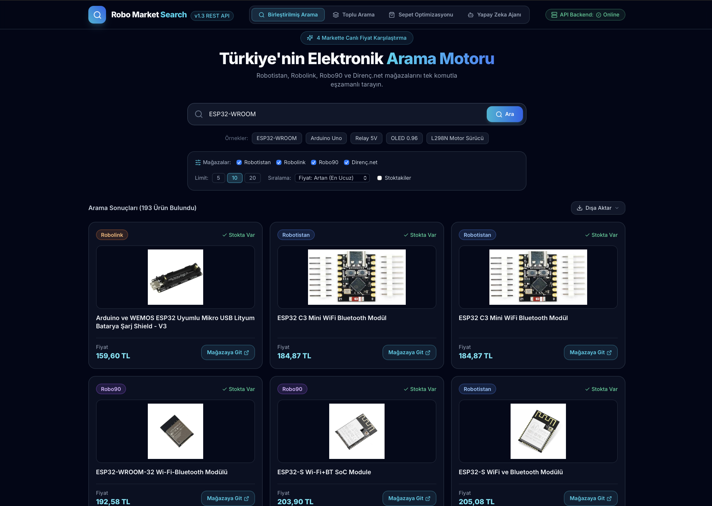
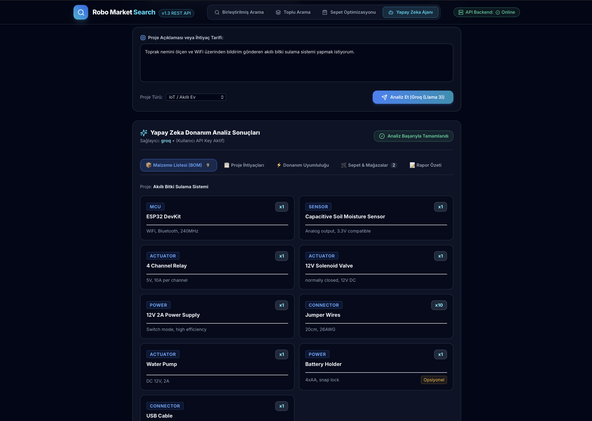
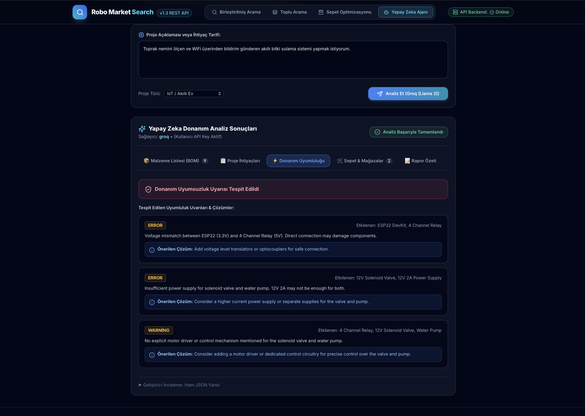
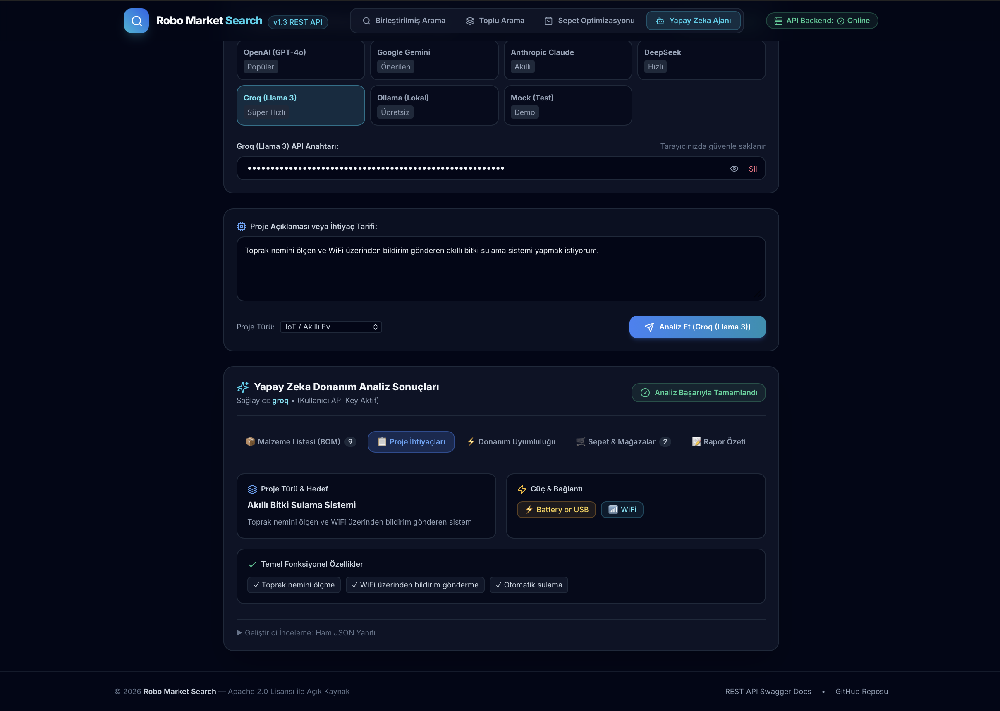
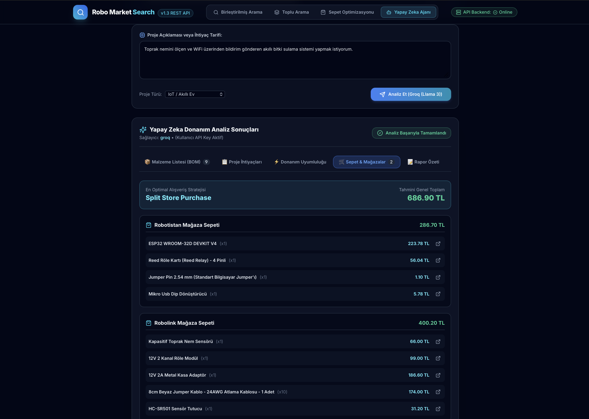

# Robo Market Search — Demo & Applications

Bu dizin, `robo-market-search` ekosisteminin web demo uygulamalarını ve servis katmanını barındırır. İki bağımsız katmana ayrılmıştır:

- **`frontend/`**: Vite 6 + React 18 + TypeScript + Tailwind CSS tabanlı Single Page Application (SPA) Önyüzü (Port `3000`).
- **`backend/`**: Production-ready `robo_market_api` REST Sunucusu (Port `8000`).

---

## 🎨 Frontend Modülleri & Özellikleri

1. **🔍 Birleştirilmiş Arama (Unified Search)**:
   - 4 markette paralel canlı arama, mağaza rozetleri, stok filtreleme, fiyat sıralama.
   - **Dışa Aktar (Export)**: Sonuçları **CSV / Excel**, **JSON**, **Markdown** olarak indirme ve **Panoya Kopyalama**.
2. **📦 Toplu Arama (Batch Search)**:
   - Birden fazla parçayı tek ekranda arama ve sonuçları gruplama.
3. **🛒 Sepet Optimizasyonu (Cart Optimizer)**:
   - Mağazalar arası kargo barajları ve en ucuz bölünmüş sepet (split cart) hesaplama.
4. **🤖 BYOK Yapay Zeka Donanım Ajanı**:
   - **Bring Your Own API Key**: OpenAI (GPT-4o), Google Gemini, Anthropic Claude, DeepSeek, Groq veya Ollama (Lokal) API anahtarı bağlama ve otonom BOM analizi.

---

## 📸 Ekran Görüntüleri (Screenshots)

### 1. 🔍 Birleştirilmiş Arama (Unified Search)


### 2. 🤖 BYOK Yapay Zeka Donanım Ajanı Ekranları
<div align="center">
  
  &nbsp;
  
  <br/><br/>
  
  &nbsp;
  
</div>

---

## 🚀 Yerel Çalıştırma

### Yöntem 1: Docker Compose (Önerilen)

Tüm sistemi (Frontend + Backend) tek bir komutla ayağa kaldırabilirsiniz:

```bash
cd demo/
docker compose up -d
```

- **Web Önyüzü**: [http://localhost:3000](http://localhost:3000)
- **REST API Sunucusu & Swagger**: [http://localhost:8000/docs](http://localhost:8000/docs)

---

### Yöntem 2: Bağımsız Çalıştırma (Lokal)

#### 🔹 Backend REST API'yi Başlatma
```bash
cd demo/backend/
python main.py
```
*(Sunucu http://localhost:8000 üzerinde çalışacaktır)*

#### 🔹 Frontend Web UI'ı Başlatma
```bash
cd demo/frontend/
npm run dev
```
*(Arayüz http://localhost:3000 üzerinde çalışacaktır)*

---

## 🌐 Canlıya Dağıtım (Cloud Deployment)

### 1. Frontend (Vercel)
Vite önyüzü `demo/frontend/vercel.json` yapılandırması ile Vercel üzerinde tek tıkla canlıya alınabilir:
- **Root Directory**: `demo/frontend`
- **Framework Preset**: `Vite`
- **Output Directory**: `dist`
- **API Proxy / Direct Backend**: `https://robo-market-search.onrender.com` canlı sunucusuna bağlanır.

### 2. Backend (Render)
FastAPI REST API `render.yaml` veya `demo/backend/Dockerfile` yapılandırması ile Render üzerinde Web Service olarak yayınlanır:
- **Canlı Sunucu**: [https://robo-market-search.onrender.com](https://robo-market-search.onrender.com)
- **Build Command**: `pip install -r requirements.txt && pip install "robo-market-search[all] @ git+https://github.com/AtaCanYmc/robo-market-search.git"`
- **Start Command**: `python main.py`
- **Healthcheck Endpoint**: `/health`
