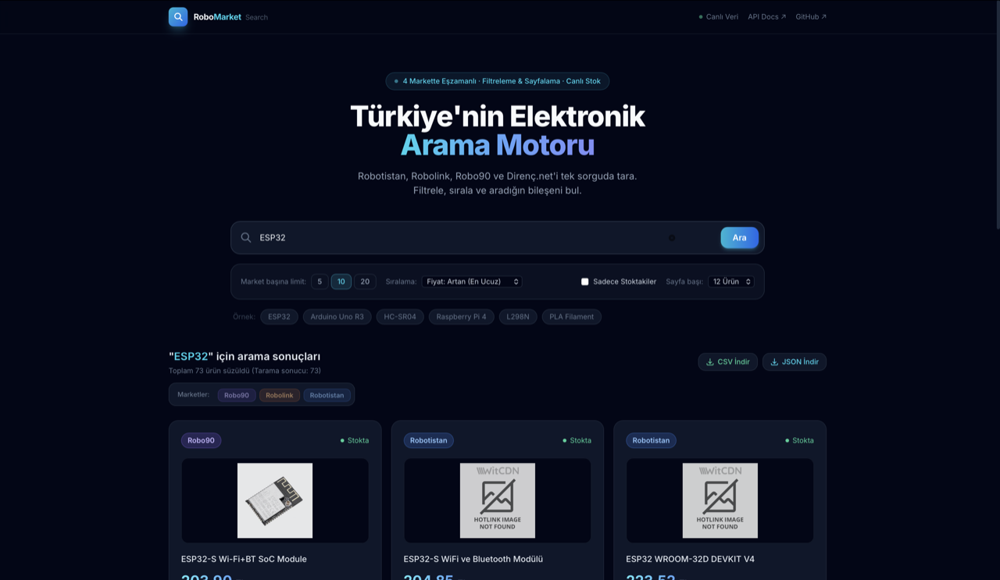

# Robo Market Search — Web Demo

Tek parça (monolithic) FastAPI + Jinja2 + HTMX web demo uygulaması.
Tailwind CSS CDN üzerinden dahil edilmiştir; derleme adımı yoktur.



## Dosya Ağacı

```
demo/
├── main.py                      # FastAPI uygulaması ve tüm endpoint'ler
├── requirements.txt             # Demo bağımlılıkları
├── README.md                    # Bu dosya
└── templates/
    ├── base.html                # Ortak layout (nav, footer, CDN linkleri)
    ├── index.html               # Ana arama sayfası (form + HTMX hookları)
    └── partials/
        ├── results.html         # HTMX partial — ürün kartları
        └── error.html           # HTMX partial — hata mesajı
```

## Mimari Özeti

| Katman       | Teknoloji        | Açıklama                                         |
|--------------|------------------|--------------------------------------------------|
| Backend      | FastAPI          | Async endpoint'ler, thread pool arama            |
| Templating   | Jinja2           | Jinja2Templates via FastAPI                      |
| Stil         | Tailwind CSS v3  | CDN üzerinden, derleme yok                       |
| Dinamizm     | HTMX 1.9         | Form submit → partial HTML swap, indicator       |
| Fontlar      | Google Fonts     | Inter (400–800)                                  |
| Arama motoru | UnifiedSearchClient | Paralel scraping, ThreadPoolExecutor          |

## Kurulum ve Çalıştırma

### 1. Sanal ortam oluştur

```bash
cd demo/
python -m venv .venv
source .venv/bin/activate          # Windows: .venv\Scripts\activate
```

### 2. Ana paketi yükle (geliştirme modu)

```bash
pip install -e ..
```

### 3. Demo bağımlılıklarını yükle

```bash
pip install -r requirements.txt
```

### 4. Geliştirme sunucusunu başlat

```bash
uvicorn main:app --reload --port 8000
```

Tarayıcıda aç: **http://localhost:8000**

### 5. API dokümantasyonu (Swagger UI)

**http://localhost:8000/api/docs**

---

## Üretim (Production) için

```bash
uvicorn main:app --host 0.0.0.0 --port 8000 --workers 4
```

## Docker ile Çalıştırma

### 1. Docker Build & Run (Manuel)

```bash
# Proje kök dizininde imajı oluşturun:
docker build -t robo-market-search-demo -f demo/Dockerfile .

# Konteyneri başlatın:
docker run -d -p 8000:8000 --name robo-demo robo-market-search-demo
```

### 2. Docker Compose ile (Kolay Yöntem)

```bash
cd demo/
docker compose up -d
```

Tarayıcıda açın: **http://localhost:8000**

## Vercel ile Canlıya Alma (Deployment)

### 1. Vercel CLI ile
```bash
# Proje kök dizininde veya demo/ klasöründe:
npm i -g vercel
vercel
```

### 2. GitHub Entegrasyonu ile
1. Vercel Dashboard'da **New Project** oluşturun.
2. `AtaCanYmc/robo-market-search` GitHub deposunu seçin.
3. Root Directory olarak `demo` klasörünü ayarlayın.
4. **Deploy** butonuna basın. Vercel `demo/vercel.json` yapılandırmasını otomatik algılayacaktır.

## Özellikler

- **Gerçek zamanlı arama** — Robotistan, Robolink, Robo90, Direnç.net
- **Paralel scraping** — `ThreadPoolExecutor` üzerinde asenkron çalışır
- **Skeleton loading** — HTMX indicator + Tailwind `animate-pulse` ile
- **Staggered animasyon** — Kartlar birer birer belirerek girer
- **Hızlı arama chips** — Örnek sorgular için tek tık
- **Keyboard shortcut** — `/` tuşu arama kutusuna odaklanır
- **Responsive** — Mobile-first, 1–3 sütun grid
- **Fiyat özeti** — En ucuz / en pahalı / fark gösterimi
