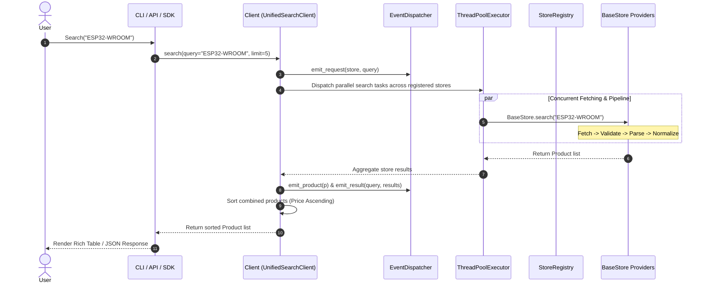

# Architecture Overview

This document details the software architecture, design principles, concurrency model, plugin system, and data flow of **Robo Market Search** as a unified **Commerce Search Framework**.

---

## 🏛️ The 4-Layered Architecture

The project is structured into four decoupled logical layers:

```
                            ┌───────────────────────────┐
                            │      Applications / UI    │
                            │ (Vite Web UI, CLI, Bot,   │
                            │  MCP Server, Mobile Apps) │
                            └─────────────┬─────────────┘
                                          │
                                          ▼
                            ┌───────────────────────────┐
                            │      robo_market_api      │
                            │ (REST API Layer: FastAPI, │
                            │  OpenAPI, BYOK Headers)   │
                            └─────────────┬─────────────┘
                                          │
                                          ▼
                            ┌───────────────────────────┐
                            │    robo_market_agent      │
                            │ (AI Layer: Requirements,  │
                            │  BOM, BYOK Providers)     │
                            └─────────────┬─────────────┘
                                          │
                                          ▼
                            ┌───────────────────────────┐
                            │    robo_market_service    │
                            │ (Search Service: Cache,   │
                            │  Synonyms, Rank, Dedupe)  │
                            └─────────────┬─────────────┘
                                          │
                                          ▼
                            ┌───────────────────────────┐
                            │    robo_market_search     │
                            │ (Commerce Search Framework│
                            │  BaseStore, Registry, HTTP│
                            │  Engine, Event Dispatcher)│
                            └───────────────────────────┘
```

### 1. Commerce Search Framework Core Layer (`robo_market_search`)
- Pure Python SDK with zero heavy web or AI dependencies.
- **BaseStore Abstract Interface & Capabilities**: Standardized contract (`BaseStore`) and capabilities matrix (`StoreCapability`).
- **Store Registry**: Pluggable provider registry (`default_registry`, `@register_store`) allowing 3rd-party store extensions via PRs.
- **Centralized HTTP Engine (`HTTPClient`)**: TLS impersonation (`curl_cffi`), automatic exponential backoff retries for 403/429/timeouts, and custom exception mapping.
- **Event Hook System (`EventDispatcher`)**: Hook system supporting `on_request`, `on_product`, `on_error`, and `on_result` callbacks.
- **Exception Hierarchy (`RoboMarketError`)**: Granular error types (`NetworkError`, `CaptchaDetectedError`, `RateLimitError`, `StoreUnavailableError`, `ParsingError`, `TimeoutError`).
- **Cart & Split Cart Optimizer**: Algorithmic optimization for single-store and multi-store split purchases with shipping cost thresholds.

### 2. Search Service Layer (`robo_market_service`)
- Provides in-memory and disk caching with configurable TTL (default 2 hours).
- Provides synonym expansion dictionary (e.g. `esp32` -> `esp-wroom-32`, `esp32 kartı`).
- Performs product ranking and deduplication.

### 3. AI Hardware Agent Layer (`robo_market_agent`)
- 7-step autonomous hardware analysis pipeline (`ProjectUnderstanderStep`, `BOMGeneratorStep`, `CompatibilityCheckerStep`, `ComponentSearcherStep`, `ProductNormalizerStep`, `ShoppingOptimizerStep`, `ReportGeneratorStep`).
- Pluggable LLM provider abstraction (`BaseLLMProvider`) supporting **Bring Your Own API Key (BYOK)** for OpenAI, Gemini, Anthropic, DeepSeek, Groq, and Ollama.

### 4. REST API & Application Layer (`robo_market_api`, CLI, MCP, Web UI)
- Production FastAPI HTTP server with OpenAPI Swagger UI (`/docs`).
- Extracts BYOK headers (`X-API-Key`, `X-Provider`).
- Serves Vite React SPA frontend.

---

## ⚡ Concurrency & Scraper Pipeline



---

## 🛡️ Exception Hierarchy

```
RoboMarketError
├── NetworkError
│   ├── StoreUnavailableError
│   ├── CaptchaDetectedError
│   ├── RateLimitError
│   └── TimeoutError
└── ParsingError
```
