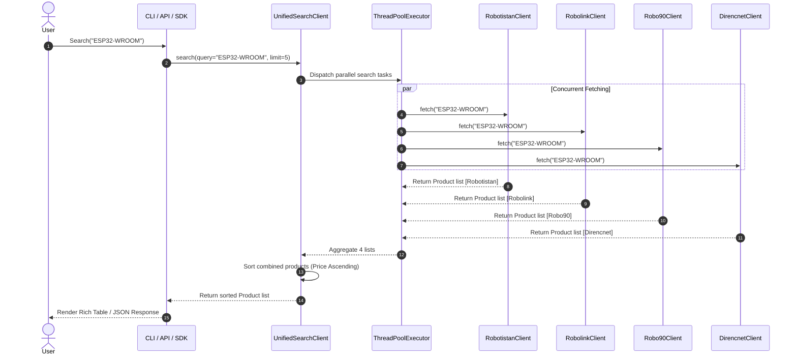

# Architecture Overview

This document details the software architecture, design principles, concurrency model, and data flow of **Robo Market Search**.

---

## 🏛️ The 4-Layered Architecture

The project is structured into four decoupled logical layers:

```
                            ┌───────────────────────────┐
                            │      Applications / UI    │
                            │ (Vite Web UI, CLI, Bot,   │
                            │  MCP Server, Mobile Apps) │
                            └─────────────┬─────────────┘
                                          │
                                          ▼
                            ┌───────────────────────────┐
                            │      robo_market_api      │
                            │ (REST API Layer: FastAPI, │
                            │  OpenAPI, BYOK Headers)   │
                            └─────────────┬─────────────┘
                                          │
                                          ▼
                            ┌───────────────────────────┐
                            │    robo_market_agent      │
                            │ (AI Layer: Requirements,  │
                            │  BOM, BYOK Providers)     │
                            └─────────────┬─────────────┘
                                          │
                                          ▼
                            ┌───────────────────────────┐
                            │    robo_market_service    │
                            │ (Search Service: Cache,   │
                            │  Synonyms, Rank, Dedupe)  │
                            └─────────────┬─────────────┘
                                          │
                                          ▼
                            ┌───────────────────────────┐
                            │    robo_market_search     │
                            │ (Core Search Library:     │
                            │  Zero AI/HTTP Dependencies│
                            └───────────────────────────┘
```

### 1. Core Library Layer (`robo_market_search`)
- Pure Python SDK with zero web framework or AI dependencies.
- Contains individual store clients (`RobolinkClient`, `RobotistanClient`, `Robo90Client`, `DirencnetClient`).
- Implements `ThreadPoolExecutor` for concurrent requests across stores.
- Features dynamic token refreshers (`TokenFetcher`) that extract CSRF/auth tokens from Javascript bundles when e-commerce APIs update.
- Implements cart optimization algorithms for split-cart and store shipping threshold optimization.

### 2. Search Service Layer (`robo_market_service`)
- Provides in-memory and disk caching with configurable TTL (default 2 hours).
- Provides synonym expansion dictionary (e.g. `esp32` -> `esp-wroom-32`, `esp32 kartı`).
- Performs product ranking and deduplication.

### 3. AI Hardware Agent Layer (`robo_market_agent`)
- 7-step autonomous hardware analysis pipeline (`ProjectUnderstanderStep`, `BOMGeneratorStep`, `CompatibilityCheckerStep`, `ComponentSearcherStep`, `ProductNormalizerStep`, `ShoppingOptimizerStep`, `ReportGeneratorStep`).
- Pluggable LLM provider abstraction (`BaseLLMProvider`) supporting **Bring Your Own API Key (BYOK)** for OpenAI, Gemini, Anthropic, DeepSeek, Groq, and Ollama.

### 4. REST API & Application Layer (`robo_market_api`, CLI, MCP, Web UI)
- Production FastAPI HTTP server with OpenAPI Swagger UI (`/docs`).
- Extracts BYOK headers (`X-API-Key`, `X-Provider`).
- Serves Vite React SPA frontend.

---

## ⚡ Concurrency & Scraper Model



---

## 🔑 Dynamic Token Refresh Architecture

E-commerce stores (e.g. Robotistan, Robolink) frequently update CSRF or authorization tokens embedded in frontend JavaScript bundles.

```
                    ┌───────────────────────────────┐
                    │ Store API returns 401 / 403   │
                    └───────────────┬───────────────┘
                                    │
                                    ▼
                    ┌───────────────────────────────┐
                    │ TokenFetcher fetches store HTML│
                    └───────────────┬───────────────┘
                                    │
                                    ▼
                    ┌───────────────────────────────┐
                    │ Regex / BS4 extracts new token│
                    └───────────────┬───────────────┘
                                    │
                                    ▼
                    ┌───────────────────────────────┐
                    │ Token saved & Request retried │
                    └───────────────────────────────┘
```

This guarantees zero-downtime scraping even when stores refresh frontend security tokens.
